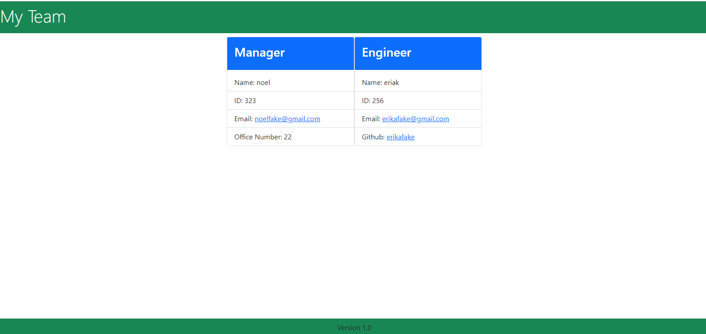

# teamProfileGenerator

## Project Description

The application will Generate a team profile for each of its members, it has an option for manager, engineer, and employee.

## Table of Contents

* title
* Installation
* Usage

## Installation

1. For installation you must start with NPM i and then NPM start in order to begin using the application
2. get jest and download for testing
3. you need to create an index.js in order to transport all of the classes into an html to create an employee library
4. you must add a class for employee, engineer, and intern, within them they contain classes that will prompt the user to correctly lable who the employee is
5. their must also be an index.html that displays each of the classes in cards and a design header.
6. The index.js will be used to create inquirer prompts for the user for each of the card to be populated 
7. The final product will be your team, and a manager

# Usage

* this application will be used to create a team
* each of the team members belongs to a specific class and requires different properties
* once the user has inputed onto the terminal they will have a generated team profiler

This is the link that demonstrates the process of creating a team profile

I tried making it center all cards in the video but it wouldnt change when I changed it on the html, and on the indexhtml.js

https://drive.google.com/file/d/1URDT_uMbVGcpz6yaex5I6QH2FYOrv6rO/view

